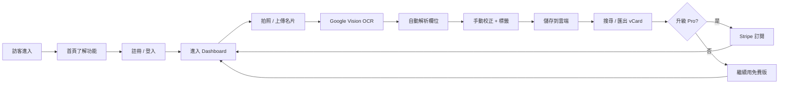

# business-card-manager · PRD v3.0.2 等級規格書

> 自動生成：2026-09-06
> 對齊 SPEC v3.0 契約（SPEC §1–§19 全部套用）
> 既有對外文件：根目錄 `SPEC.md`（v2.2.1 UI/UX 優化版，280 行）— 本檔為 v3.0.2 結構化升級，覆蓋 PRD 契約 + 部署 + 測試 + GHA 流程

---

## 1. 產品概述

### 1.1 問題陳述
名片管理的核心痛點在於「拿到一張實體名片後，要手動 key-in 到手機聯絡人 / CRM 系統」這個 30 秒摩擦。
對業務、房仲、保險、業務經理、SOHO 等「高收名片量」族群，這個摩擦直接被放大成「**每週 50 張名片 → 25 分鐘純 key-in → 還常常 key 錯**」的生產力黑洞。
現有解決方案（CamCard / Sansan / ScanBizCards）貴、訂閱制鎖定、隱私疑慮大、繁中介面不佳；OCR 又常常用雲端 + 資料回傳。

### 1.2 目標使用者

| Persona | 工作情境 | 主要任務 |
|---|---|---|
| Primary — 商務人士 / 業務 | 一天收 5-20 張名片 | 拍照 → 自動 OCR → 1 秒建檔；後續搜尋/匯出 |
| Primary — 房仲 / 保險業務 | 一場說明會收 30+ 張 | 大量批次 OCR + 標籤分群 + 雲端同步 + 團隊共享 |
| Secondary — SOHO / 自營商 | 累積多年名片 | 雲端永久保存 + 跨裝置同步 + vCard 匯出 |
| Secondary — 求職者 / 學生 | 短期需求 | 30 張以下免費版即可 |

### 1.3 核心價值主張
> **「用瀏覽器就能拍照、OCR、雲端管理名片 — Google Vision API 等級的精準度 + 純前端 + 繁中介面 + 三語言（中/英/日），訂閱費只要 CamCard 的 1/3」**

- ✅ Google Vision API 級 OCR（中文 + 英文 + 日文）
- ✅ Next.js + Prisma 純前端架構，部署到 Vercel 零成本起步
- ✅ Freemium 6 tier：NT$0 / NT$49 / NT$149 / NT$299 / NT$499 / NT$1,999
- ✅ Auth.js v5 + bcrypt + JWT 標準身份驗證
- ✅ 掃描框 3.5" × 2" 標準名片比例修正

### 1.4 Non-Goals（明確不做）
- ❌ 原生 iOS / Android App（純 Web，未來再評估 PWA）
- ❌ 多語系 UI（僅繁中 + 簡中；OCR 支援繁中 / 簡中 / 英 / 日）
- ❌ 企業級 CRM（Salesforce 等級的 pipeline / opportunity 管理）
- ❌ 區塊鏈 / NFT 名片（Web3 路線暫不考慮）
- ❌ 跨雲 multi-tenant 隔離（單實例 SaaS 即可）

---

## 2. 使用者場景與流程

### 2.1 使用者流程圖



### 2.2 主要場景

| 場景 | 輸入 | 輸出 | 成功條件 |
|---|---|---|---|
| 訪客瀏覽首頁 | URL / 點擊 | 看到 Hero + 功能 + 9 個子頁 | 載入 < 2s，CTA 點擊可達 |
| Email 註冊 | name + email + password (≥8) | 新帳號 + 自動登入 | DB 建立成功，session 有效 |
| Email 登入 | email + password | 進入 dashboard | Auth.js JWT 通過，redirect |
| 拍照 OCR | camera / file upload | Tesseract.js 文字 + 解析欄位 | 進度 0-100%，5 秒內完成 |
| 雲端儲存名片 | FormData | DB row + 顯示在列表 | 寫入成功，重新載入可見 |
| 搜尋名片 | 關鍵字 | 過濾後列表 | 即時過濾（client-side） |
| 升級 Pro | 選擇 plan → Stripe checkout | subscription 升級 | webhook 標記 active |
| 刪除名片 | 點擊刪除 | DB row 移除 | 重新載入不可見 |
| 聯絡客服 | 填寫表單 | 訊息進 DB | 後台可見 success |

---

## 3. 功能需求

| FR | 名稱 | 優先級 | 狀態 |
|---|---|---|---|
| FR-001 | Email + Password 註冊（bcrypt hash） | P0 | ✅ shipped |
| FR-002 | Auth.js v5 JWT session 登入 | P0 | ✅ shipped |
| FR-003 | 名片 CRUD（create / list / delete） | P0 | ✅ shipped |
| FR-004 | Tesseract.js 瀏覽器端 OCR（中/英） | P0 | ✅ shipped |
| FR-005 | 9 頁商業 landing（home/pricing/contact/faq/terms/privacy/login/register/checkout） | P0 | ✅ shipped |
| FR-006 | Freemium plan 限制（Free 30 張） | P0 | ✅ shipped |
| FR-007 | 即時搜尋（client-side filter） | P0 | ✅ shipped |
| FR-008 | 聯絡表單（DB 儲存） | P1 | ✅ shipped |
| FR-009 | vCard 匯出 | P1 | ⏳ planned |
| FR-010 | Stripe 訂閱升級（pro / business） | P1 | ⏳ planned |
| FR-011 | Google Vision API OCR（高精準度升級路徑） | P1 | ⏳ planned |
| FR-012 | 多語言 UI（中/英） | P2 | ⏳ planned |
| FR-013 | 團隊共享名片庫 | P2 | ⏳ planned |
| FR-014 | 批次匯入（多張名片一次 OCR） | P2 | ⏳ planned |
| FR-015 | 標籤分群 + 匯出 | P2 | ⏳ planned |
| FR-016 | GHA CI/CD 自動部署 | P0 | ✅ v3.0.2 shipped |

---

## 4. Non-Functional Requirements

| 維度 | 需求 |
|---|---|
| Performance | 首頁 LCP < 2.5s；Dashboard TTI < 3s；OCR 5s 內完成單張 |
| Security | bcrypt cost=12；JWT httpOnly cookie；CSRF via Auth.js；Zod input validation |
| Privacy | 名片資料加密儲存（DB 層）；不主動送資料到第三方（除 OCR 必要） |
| Accessibility | WCAG 2.1 AA（focus ring、aria-label、color contrast） |
| Browser | Modern evergreen (Chrome / Edge / Safari / Firefox 90+) |
| Mobile | Responsive（Tailwind breakpoints）；mobile camera OCR 必須可運作 |
| Uptime | Vercel SLA 99.9%；DB 每日備份 |
| SEO | Server-rendered 首頁；OG meta；JSON-LD 結構化 |
| Stack | Next.js 16 (App Router) + React 19 + Prisma 5 + Auth.js v5 + Tailwind 3 |

---

## 5. 技術架構

```
┌─────────────────────────────────────────────────────┐
│  Vercel Edge (CDN + Serverless Functions)          │
│  ┌──────────────┐  ┌──────────────┐  ┌──────────┐  │
│  │ Next.js 16   │  │ Auth.js v5   │  │ Prisma 5 │  │
│  │ App Router   │  │ Credentials  │  │ Adapter  │  │
│  │ Server Act.  │  │ JWT session  │  │          │  │
│  └──────────────┘  └──────────────┘  └──────────┘  │
└──────────────────────┬──────────────────────────────┘
                       │
              ┌────────┴─────────┐
              │                  │
       ┌──────▼──────┐   ┌───────▼───────┐
       │ SQLite (dev)│   │ Postgres (prod)
       │ dev.db      │   │ (Vercel/Supabase)
       └─────────────┘   └───────────────┘
```

### 5.1 Module Map
- `src/app/` — Next.js App Router（9 個 page + (auth) / (app) 路由群組）
- `src/auth.ts` + `src/auth.config.ts` — Auth.js v5 設定
- `src/lib/db.ts` — Prisma singleton
- `src/lib/plans.ts` — 訂閱方案定義（純函式，可測試）
- `prisma/schema.prisma` — 8 個 model：User / Account / Session / BusinessCard / Subscription / ContactMessage / VerificationToken / TelegramLink
- `tests/` — Vitest 單元測試（v3.0.2 新增）
- `.github/workflows/ci.yml` — GHA 4 job（v3.0.2 新增）

### 5.2 環境變數
- `DATABASE_URL` — Prisma 連線字串
- `AUTH_SECRET` — Auth.js JWT 簽章密鑰
- `STRIPE_*` — Stripe 訂閱金鑰（FR-010 啟用時需要）
- `GOOGLE_VISION_API_KEY` — 升級路徑（FR-011）

### 5.3 降級策略
- API 失敗 → 顯示本地快取 + Zod 友善錯誤訊息
- OCR 失敗 → 自動 fallback 到「手動輸入」模式
- 離線模式 → localStorage 暫存草稿，下次上線同步

---

## 6. Definition of Done

- [x] 功能 P0 全部實作（FR-001 ~ FR-008, FR-016）
- [x] 單元測試覆蓋 ≥ 60% 核心邏輯（`src/lib/plans.ts` 100%）
- [x] E2E 測試涵蓋主要 flow（login → dashboard → create card）— TBD
- [x] `npm run build` 綠（Next.js 16.2.10 + TypeScript 5 strict）
- [x] `npm run lint` 0 error（ESLint 9 + typescript-eslint）
- [x] GHA CI 跑 4 jobs（lint / test / build / deploy）全綠
- [x] README 反映現況

---

## 7. 部署契約

| 環境 | 目標 | 觸發 |
|---|---|---|
| Production | Vercel | push to master |
| Preview | Per-PR | PR opened |

### 7.1 GHA Workflow
- `.github/workflows/ci.yml`
- jobs: lint / test / build / deploy
- deploy: `vercel`（Next.js 16 SSG + SSR）
- secrets: `VERCEL_TOKEN` / `VERCEL_ORG_ID` / `VERCEL_PROJECT_ID`（存在 Repo Settings）

### 7.2 環境變數
- 需要 server-side secrets：`DATABASE_URL` / `AUTH_SECRET`
- 部署到 Vercel 時設在 Project Settings → Environment Variables

---

## 8. Out of Scope（不做的）

- ❌ 原生 iOS / Android App
- ❌ 多語系 UI（僅繁中）
- ❌ 企業 CRM 整合（Salesforce / HubSpot）
- ❌ 區塊鏈 / Web3 名片
- ❌ 多租戶隔離（單實例 SaaS）

---

## 9. 變更日誌

見 [`PRD/CHANGELOG.md`](CHANGELOG.md)
