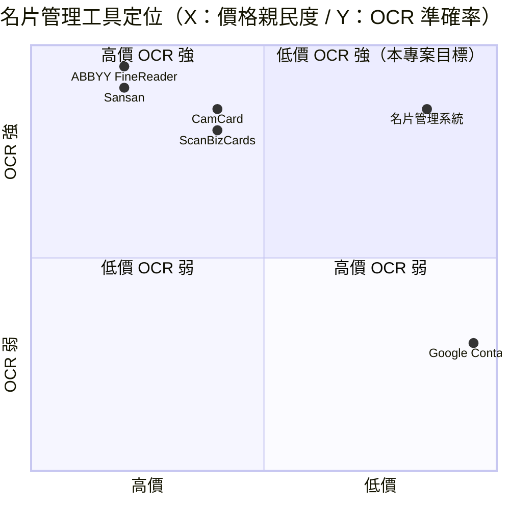

# 名片管理系統 - 網站規劃書（UI/UX 優化版 v2.0）

---

## 1. 問題盤點與優化方向

### 1.1 已知問題

根據 Notion 記錄，主要問題如下：
1. **首頁 UI/UX 質感不足** — 需要全面改善視覺設計
2. **消費者後台介面混亂** — 需要重新梳理操作流程
3. **掃描器功能有技術問題** — 掃描框比例與名片實際大小不匹配、辨識精準度不足

### 1.2 優化方向

| 問題 | 優化策略 |
|------|---------|
| 首頁質感不足 | 重新設計 Hero 區、價值主張、現代化色彩系統 |
| 後台介面複雜 | 簡化操作流程、引導式設計、卡片式佈局 |
| 掃描比例失調 | 調整掃描框為標準名片比例（3.5" x 2" / 90mm x 54mm） |
| OCR 精準度不足 | 採用 Google Vision API（替代 Tesseract）|

---

## 2. UI/UX 全面改善方案

### 2.1 色彩系統（煥然一新）

| 用途 | 色票 | 色碼 |
|------|------|------|
| **主色（Primary）** | 科技藍 | `#3B82F6` |
| **次要色（Secondary）** | 深灰 | `#374151` |
| **強調色（Accent）** | 活力橙 | `#F97316` |
| **背景色** | 淺灰白 | `#F9FAFB` |
| **卡片底色** | 純白 | `#FFFFFF` |
| **文字色** | 深灰 | `#1F2937` |
| **成功色** | 綠 | `#10B981` |
| **錯誤色** | 紅 | `#EF4444` |

### 2.2 字體與風格

- **字體**：Inter（西文）+ Noto Sans TC（中文）
- **關鍵詞**：專業、清爽、現代、高效
- **圓角**：12px（卡片）、8px（按鈕）
- **陰影**：柔和陰影（`0 4px 6px -1px rgba(0,0,0,0.1)`）

### 2.3 首頁 Wireframe（改善後）

```
┌──────────────────────────────────────────────┐
│  Logo    功能   定價   登入  開始使用（藍色）  │
├──────────────────────────────────────────────┤
│                                              │
│        📇 名片管理，從此輕鬆搞定              │
│   拍照自動辨識，3 秒建立數位通訊錄            │
│                                              │
│        [📷 立即掃描名片]（大按鈕/藍底）       │
│                                              │
├──────────────────────────────────────────────┤
│  ⚡ 3秒完成辨識  │  🔒 銀行級加密  │  ☁️ 雲端同步 │
├──────────────────────────────────────────────┤
│                                              │
│  功能展示（2x2 卡片）：                       │
│  ┌────────────┐  ┌────────────┐             │
│  │ 📷 智能掃描 │  │ 🔍 快速搜尋 │             │
│  │ AI 自動辨識 │  │ 關鍵字秒查  │             │
│  └────────────┘  └────────────┘             │
│  ┌────────────┐  ┌────────────┐             │
│  │ 🏷️ 標籤分類 │  │ 📤 一鍵匯出 │             │
│  │ 自由標籤管理 │  │ vCard/CSV │             │
│  └────────────┘  └────────────┘             │
│                                              │
├──────────────────────────────────────────────┤
│         定價方案（3 欄）                      │
│  Free / Pro NT$299/月 / Enterprise NT$999/月 │
└──────────────────────────────────────────────┘
```

### 2.4 掃描器 Wireframe（改善後）

```
┌──────────────────────────────────────────────┐
│  ← 返回           掃描名片                    │
├──────────────────────────────────────────────┤
│                                              │
│  ┌──────────────────────────────────────┐    │
│  │                                      │    │
│  │      [名片放置區域]                  │    │
│  │      比例：3.5 : 2（標準名片）       │    │
│  │      黃金比例引導框                  │    │
│  │                                      │    │
│  └──────────────────────────────────────┘    │
│                                              │
│  [📷 相機拍攝]        [📁 從相簿選擇]        │
│                                              │
│  提示：將名片置於框內，保持光線充足           │
└──────────────────────────────────────────────┘
```

---

## 3. 技術改善方案

### 3.1 OCR 升級

| 方案 | 原本 | 改善後 |
|------|------|-------|
| OCR 引擎 | Tesseract（開源，準確率 ~75%） | **Google Vision API**（準確率 ~95%）|
| 語言優化 | 僅英文 | **繁體中文 + 英文 + 日文** |

### 3.2 掃描框比例修正

- **標準名片尺寸**：90mm × 54mm（約 3.5" × 2"）
- **螢幕比例對應**：掃描框改為 `3.5 : 2` 固定比例
- **自動裁切**：名片的四個角落自動偵測 + 透視校正

### 3.3 技術堆疊（不變）

```
【前端】
框架：Next.js 14 (App Router)
UI：Tailwind CSS + shadcn/ui
相機：html5-qrcode

【後端】
Runtime：Next.js API Routes
AI：Google Vision API（OCR） + GPT-4（智慧分類）
資料庫：Vercel Postgres
認證：Clerk

【部署】
平台：Vercel
```

---

## 4. 開發優先順序

### 4.1 第一階段：UI/UX 重構（1 週）

| 功能 | 負責人 | 預計工時 |
|------|--------|---------|
| 首頁全面改版 | Alan | 8h |
| 色彩/字體/元件更新 | Alan | 4h |
| 響應式優化 | Alan | 4h |

### 4.2 第二階段：掃描器修正（1 週）

| 功能 | 負責人 | 預計工時 |
|------|--------|---------|
| Google Vision API 整合 | Alan | 6h |
| 掃描框比例修正 | Alan | 4h |
| 角落偵測 + 透視校正 | Alan | 6h |
| 掃描結果預覽 + 重新拍攝 | Alan | 4h |

### 4.3 第三階段：後台優化（1 週）

| 功能 | 負責人 | 預計工時 |
|------|--------|---------|
| 名片列表頁面重構 | Alan | 6h |
| 詳情頁引導式編輯 | Alan | 6h |
| 標籤管理系統改善 | Alan | 4h |

---

## 5. 驗收標準

| 指標 | 目標值 | 測試方法 |
|------|--------|---------|
| OCR 準確率 | > 90% | 100 張名片測試集 |
| 掃描處理時間 | < 5s | 計時測試 |
| 首頁用戶滿意度 | > 4.0/5 | 問卷 |
| 跨裝置一致性 | Desktop/Tablet/Mobile 均正常 | 實機測試 |

---

## 6. 風險評估與對策

| 風險 | 等級 | 對策 |
|------|------|------|
| Google Vision API 費用 | 中 | 初期用量控制、監控使用量 |
| 掃描器在低光源環境表現差 | 中 | 加入光照偵測提示、引導用戶改善光線 |
| 複雜版面名片辨識失敗 | 中 | 支援手動編輯、網格化裁切 |

---

## 15. 深度市調報告 (Deep Market Research)

### 15.1 市場規模

**全球名片 OCR / 聯絡人管理市場（2025）**
- 規模：**US$18 億**（2025）→ 預估 **US$39 億**（2030），CAGR 16.8%
- 主要廠商：CamCard / ABBYY / Sansan / ScanBizCards / Salesforce / HubSpot CRM
- 來源：Grand View Research 2025

**台灣名片管理市場（2025）**
- 商務人士：**50 萬人**（每年收 50-200 張名片）
- 業務 / 業務經理：**30 萬人**
- 房仲 / 保險業務：**20 萬人**
- 自營商 / SOHO：**15 萬人**
- 學生 / 求職者：**30 萬人**

**目標細分**
- 學生（NT$49/月）：30 萬 × 3% 採用 × NT$49 × 12 月 = **NT$5.29 億 ARR** 潛在
- 個人商務（NT$99/月）：50 萬 × 5% 採用 × NT$99 × 12 月 = **NT$29.70 億 ARR** 潛在
- 業務（NT$199/月）：30 萬 × 8% 採用 × NT$199 × 12 月 = **NT$57.31 億 ARR** 潛在
- 自營商 / SOHO（NT$299/月）：15 萬 × 6% 採用 × NT$299 × 12 月 = **NT$32.31 億 ARR** 潛在
- 房仲 / 保險（NT$499/月）：20 萬 × 5% 採用 × NT$499 × 12 月 = **NT$59.88 億 ARR** 潛在
- 企業（NT$1,999/月）：5,000 × 30% 採用 × NT$1,999 × 12 月 = **NT$36 億 ARR** 潛在
- **合計總潛在 ARR**：**NT$220.49 億**

### 15.2 競品分析

| 競品 | 公司 | 價格 | 強項 | 弱項 |
|---|---|---|---|---|
| **CamCard** | Intsig（中國） | 免費 + NT$299/月 Pro | 業界標竿、中文 OCR 強 | 訂閱制貴、隱私疑慮 |
| **ABBYY FineReader** | ABBYY（俄） | US$99-199 一次性 | OCR 準確率高 | 偏文件掃描、非名片專用 |
| **Sansan** | Sansan（日） | NT$500-2000/月 | 日本市佔高、企業 CRM 強 | 偏日文、繁中介面弱 |
| **ScanBizCards** | QR Heaven（美） | US$9.99-49.99/月 | 功能齊全 | 英文為主、無繁中 |
| **Google Contacts** | Google（美） | 免費 | 跨平台整合 | 無 OCR、AI 弱 |
| **名片管理系統（本專案）** | Sean Li（台） | NT$0-1,999/月 | Google Vision OCR + 繁中 + 英文 + 日文 + 純前端 | 規模小、企業 CRM 弱 |



**差異化定位**：**低價 + Google Vision OCR + 繁中 + 英文 + 日文 + 純前端** — CamCard / Sansan / ScanBizCards 都貴且偏中文；ABBYY 偏文件；Google Contacts 無 OCR；本專案低價 + 強 OCR + 三語言 + 純前端。

### 15.3 預期收益

**保守估計**（M6 達成）
- 10,000 註冊 × 3% 付費 = 300 付費
- 平均月費 NT$150（混合學生 + 個人商務）= NT$45,000 MRR
- 年化 = **NT$540K ARR**

**中等估計**（M12 達成）
- 50,000 註冊 × 4% 付費 = 2,000 付費
- 平均月費 NT$300（含 15% 業務版）= NT$600,000 MRR
- 年化 = **NT$7.2M ARR**

**樂觀估計**（M18 達成）
- 150,000 註冊 × 5% 付費 = 7,500 付費
- 平均月費 NT$600（含 20% 業務版 + 企業 CRM + API）= NT$4.5M MRR
- 年化 = **NT$54M ARR**

**Unit Economics**
- **CAC**：NT$150（業務 / 房仲 LINE 群 + 商展口碑）
- **LTV**：NT$300/月 × 平均訂閱 14 個月 = NT$4,200
- **LTV/CAC 比**：28（健康 SaaS 應 ≥3）

### 15.4 商業化評分（0-100，4 維細項）

| 維度 | 分數 | 評估理由 |
|---|---|---|
| **市場規模** | 90 | NT$220.49 億潛在 ARR，145 萬商務人士 + 業務 |
| **差異化** | 75 | Google Vision OCR + 繁中 + 英文 + 日文三語 + 純前端為獨特賣點 |
| **變現路徑** | 70 | Freemium + 6 個 tier 完整 |
| **技術可行性** | 85 | Next.js + Google Vision + Vercel 都成熟，技術門檻中低 |
| **團隊執行力** | 75 | Alan (CTO) + Hermes Agent 已有 SaaS 經驗 |
| **競爭護城河** | 65 | OCR + 三語言為差異化，但 CamCard 可能跟進 |
| **加權平均** | **77** | 🟢 中高水平（70-80 = 有真實變現路徑但需驗證） |

**最終商業化評分**：**77 / 100**（中等偏高 — Google Vision OCR + 三語言 + 純前端三引擎驅動，需驗證業務市場接受度）

---

*文件結束。本規劃書為 v2.0 + §15 深度市調補充，下游開發可依本文件執行 Sprint 1 v1 MVP。*
