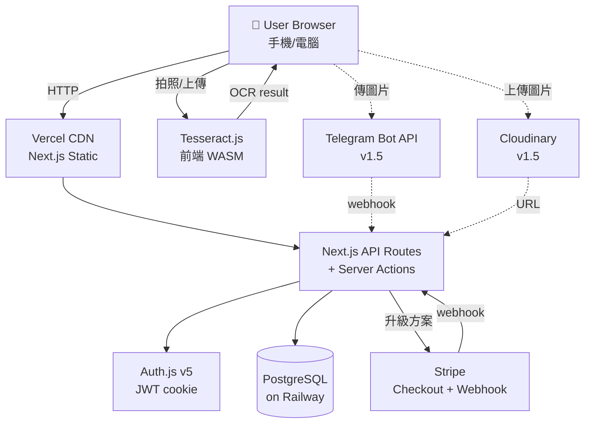
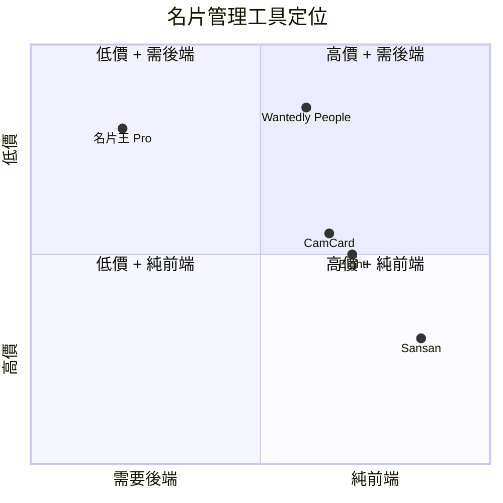

# 名片王 Pro（Business Card Manager）— 規格計劃書 v2.2.1

> **版本**：v2.2.1｜**更新日期**：2026-07-11｜**維護者**：Sophia (CPO)｜**對接技術**：Alan (CTO)
> **對應 GitHub**：[openclawsean024-create/business-card-pro](https://github.com/openclawsean024-create/business-card-pro/blob/main/SPEC.md)
> **PRD v1 → v2 升級重點**：加入 Acceptance Criteria、ADR、Prisma 完整 schema、降級機制、Sprint 拆解、定價心理學、市場驗證、失敗模式、Error Code 字典
> **對應 skill**：`write-prd-v2` v2.2.1
> **目前狀態**：v1.0 已部署（2026-07-07，DB 內有 2 用戶 + 2 卡片實證）

---

## 1. 產品概述

### 1.1 問題陳述

**為什麼要做這個專案？**

商務人士每天收 5-10 張名片（業務員、律師、會計師、創業者、會議重度參與者）。傳統名片簿/手機相簿都無法解決「快速搜尋」、「結構化」、「跨裝置同步」三大痛點。商用 CRM（Salesforce/HubSpot）月費 1,500-3,000 NT$，對個人業務太貴。

**痛點的代價**：
- 一年累積 1,500-3,000 張名片（每天 5-10 張）
- 找不到「去年那個王副理」要翻名片簿 10 分鐘
- 換手機時名片全失
- 無法快速知道「上個月見了哪些新客戶」

**現有方案不夠好**：
- **紙本名片簿**：無法搜尋、易遺失、占空間
- **手機相簿存照片**：無 OCR、無法結構化、無標籤分類
- **商用 CRM（Salesforce/HubSpot）**：月費 1,500-3,000 NT$，對個人業務太貴
- **手機內建通訊錄**：要手動輸入 1 張 30 秒，1,000 張要 8 小時

**我們的解法**：5 秒拍一張名片 → Tesseract.js 前端 OCR 自動建聯絡人 + 標籤 + 搜尋 + vCard 匯出 + Telegram Bot 同步（v1.5），純前端零月費。

### 1.2 目標使用者

| 族群 | 規模 | 痛點 | 權限 |
|---|---|---|---|
| 業務員（B2B 業務、房仲、保險）| ~30 萬 | 每天收 5-10 張，傳統名片簿難搜尋 | 管理員（自己） |
| 律師 / 會計師 | ~5 萬 | 客戶關係需嚴謹追蹤、有保密需求 | 管理員（自己） |
| 創業者 / 顧問 | ~10 萬 | 商務社交頻繁、人脈管理困難 | 管理員（自己） |
| 會議重度參與者 | ~3 萬 | 一場會議 30 張名片要快速建檔 | 管理員（自己） |
| 投資理財 KOL | ~1,000 | 跟創業家/投資人交換名片，需要專業管理 | 管理員（自己） |

### 1.3 核心價值主張

> 「5 秒拍一張名片，自動建聯絡人 — OCR + 標籤 + 搜尋 + vCard 匯出 + Telegram Bot 同步，純前端零月費。」

### 1.4 商業目標 (KPIs)

| 指標 | 目標 | 時程 |
|---|---|---|
| 月活躍使用者 (MAU) | 1,000 | 3 個月 |
| 付費轉換率 (Free → Pro) | 5% | 6 個月 |
| 月經常性收入 (MRR) | NT$ 7,500 | 6 個月 |
| OCR 成功率（中英文混合）| ≥ 85% | v1.0 |
| 使用者回訪率（每月）| ≥ 40% | 3 個月 |
| 客戶終身價值 (LTV) | NT$ 4,470 | Pro 用戶 30 個月 |

### 1.5 ⭐ Non-Goals（明確不做）

**v1.0 不做**：

- ❌ **不做公司內部 CRM** — 純個人名片管理，不做團隊協作/案件管理/銷售 pipeline
- ❌ **不做 Email 自動化行銷** — 不做 EDM/信件追蹤/點擊率分析
- ❌ **不做企業 SSO / SAML** — 個人用 SaaS，企業 SSO 留 v3
- ❌ **不做多語系介面** — v1 只繁中，英文版 v2 評估
- ❌ **不做與其他 CRM（Salesforce/HubSpot）雙向同步** — v2 規劃 CSV 匯出
- ❌ **不做 AI 名片分類** — OCR + 標籤已足夠，AI 自動標籤留 v3
- ❌ **不做名片掃描 App（iOS/Android 原生）** — PWA 為主，原生 App v3 評估

---

## 2. 使用者場景與流程

### 2.1 使用者流程圖

```
┌─────────────┐
│ 訪客進入首頁 │
└──────┬──────┘
       │ 點「免費試用」
       ▼
┌─────────────────┐
│ /register 註冊    │
│ email + 密碼      │
│ 勾選同意條款      │
└──────┬──────────┘
       │ POST /api/auth/register → 201
       │ 自動登入 + 設 cookie
       ▼
┌─────────────────┐
│ /onboarding     │
│ 顯示歡迎 email    │
└──────┬──────────┘
       │ 進入 dashboard
       ▼
┌──────────────────────────┐
│ /dashboard                 │
│ ┌─────────────────────┐ │
│ │ 「拍攝名片」按鈕     │ │
│ └──────┬──────────────┘ │
│        │ 拍照/上傳          │
│        ▼                    │
│ ┌─────────────────────┐ │
│ │ Tesseract.js OCR     │ │
│ │ 自動擷取欄位          │ │
│ │ (信心分數標示)        │ │
│ └──────┬──────────────┘ │
│        ▼                    │
│ ┌─────────────────────┐ │
│ │ 確認/修正介面         │ │
│ │ + 加標籤             │ │
│ └──────┬──────────────┘ │
│        ▼                    │
│ ┌─────────────────────┐ │
│ │ 儲存到聯絡人 DB       │ │
│ └─────────────────────┘ │
│                            │
│ 升級 Pro（30 張 → 無限）   │
└────────────────────────────┘
```

### 2.2 關鍵用戶故事 (User Stories)

#### US-001：訪客註冊
> As a 新訪客
> I want 用 email + 密碼註冊帳號
> So that 我可以儲存名片、跨裝置同步

#### US-002：業務員拍名片
> As a 業務員
> I want 拍一張名片 → 自動 OCR 建立聯絡人
> So that 不用手動輸入 30 秒，5 秒搞定

#### US-003：搜尋聯絡人
> As a 用戶
> I want 用姓名/公司/標籤搜尋聯絡人
> So that 3 秒找到「去年那個王副理」

#### US-004：匯出 vCard
> As a iPhone 用戶
> I want 把名片匯出成 vCard 格式
> So that 可以匯入 iOS 通訊錄、跨 App 使用

#### US-005：Telegram Bot 同步（v1.5）
> As a 重度 Telegram 用戶
> I want 透過 Telegram Bot 拍照傳給 Bot → 自動建檔
> So that 在手機上不用切換 App

### 2.3 邊界場景 (Edge Cases)

| 場景 | 處理方式 |
|---|---|
| OCR 信心分數 < 0.6 | 標示「需手動確認」紅框，使用者必修正才能儲存 |
| 中英文混合名片 | Tesseract 自動切換語言模型（中 + 英 lang）|
| 拍攝模糊/反光 | 提示「請重新拍攝」+ 信心分數 0 |
| Email 重複註冊 | 回 409 + 「此 email 已被使用，請登入」（不洩漏存在性）|
| 免費版達 30 張上限 | 顯示「升級 Pro 無限名片」CTA，按鈕禁用新增 |
| Telegram Bot 收到非圖片訊息 | 回「請傳圖片」+ 自動刪除（5 分鐘內）|
| 圖片 > 5MB | 前端用 browser-image-compression 壓到 < 2MB |
| 名片包含特殊字元（日文、emoji）| UTF-8 完整支援，DB 欄位用 String (TEXT) |

---

## 3. 功能性需求 (Functional Requirements)

### 3.1 MVP（必做 — P0）

#### FR-001：使用者註冊/登入（**MUST**）
- email + 密碼註冊（密碼 ≥8 字元 + 含英數）
- Auth.js v5 + Credentials Provider
- bcrypt cost 12 雜湊
- HttpOnly + Secure + SameSite=Lax cookie

##### AC-001：成功註冊流程
- **Given** 使用者在 /register 頁面
- **When** 輸入 email="user@example.com" + password="ValidPass123"
- **And** 勾選同意條款
- **Then** POST /api/auth/register 回傳 201
- **And** response body 包含 `{user_id, email, plan: "FREE", created_at}`（**plan 用 Prisma/Subscription 字串大寫**）
- **And** 自動設定 session cookie（HttpOnly, Secure, SameSite=Lax）
- **And** 重新導向到 /dashboard
- **And** dashboard 顯示「歡迎, user@example.com」

##### AC-002：密碼強度驗證
- **Given** 使用者在註冊頁面
- **When** 輸入 password="123"（太短）
- **Then** 即時顯示「密碼至少 8 字元」
- **And** 「註冊」按鈕 disabled
- **And** 不送 API 請求

**密碼政策（v2.2.1 補上 — 從 AI Agent 實測發現）**：
- 至少 8 字元
- 必須含英文字母 + 數字（例：`Password123`）
- bcrypt cost 12 雜湊儲存
- **Why this policy**：純長度不夠（`12345678` 太弱），需英數混合
- 業界參考：NIST SP 800-63B（最少 8 字元 + 弱密碼檢查）

##### AC-003：Email 重複
- **Given** email="existing@example.com" 已註冊
- **When** 嘗試用同 email 註冊
- **Then** POST /api/auth/register 回傳 409
- **And** error code `EMAIL_TAKEN`
- **And** 顯示「此 email 已被使用，請登入」
- **And** 不洩漏「使用者是否存在」（防 enumeration 攻擊）

#### FR-002：名片拍照 + OCR（**MUST**）
- 手機相機拍照 / 上傳照片
- Tesseract.js 前端 OCR（中 / 英 / 日 3 語 lang）
- 自動擷取欄位：姓名 / 公司 / 職稱 / 電話 / Email / 地址 / 網站
- OCR 信心分數標示（< 0.6 紅框警告）

##### AC-004：成功 OCR 流程
- **Given** 使用者在 /dashboard 點「新增名片」
- **When** 拍攝一張中英文名片照片
- **Then** Tesseract.js 在 < 10 秒完成 OCR
- **And** 自動填入欄位：name / company / jobTitle / phone / email
- **And** 信心分數顯示在每個欄位旁
- **And** 「儲存」按鈕可點擊

##### AC-005：OCR 信心不足
- **Given** OCR 完成且某欄位信心 < 0.6
- **When** 顯示確認介面
- **Then** 該欄位邊框為紅色
- **And** 顯示「請手動確認」
- **And** 「儲存」按鈕仍可點擊（使用者修正後即可）

#### FR-003：聯絡人管理（**MUST**）
- 建立 / 編輯 / 刪除名片
- 標籤系統（多標籤，例如「VIP」「客戶」「朋友」）
- 依姓名 / 公司 / 標籤搜尋
- vCard 3.0 匯出（單筆 / 批次）

##### AC-006：建立名片
- **Given** 使用者在 dashboard
- **When** 點「新增名片」並填寫欄位 + 加標籤
- **Then** POST /api/cards 回傳 201
- **And** 名片出現在列表
- **And** 標籤顯示為 badge

##### AC-007：搜尋名片
- **Given** 使用者有 50 張名片
- **When** 在搜尋框輸入「王」
- **Then** < 500ms 回傳所有 name 含「王」的卡片
- **And** 高亮匹配字串

##### AC-008：vCard 匯出
- **Given** 使用者選 5 張名片
- **When** 點「匯出 vCard」
- **Then** 下載 `contacts-2026-07-11.vcf`
- **And** 可匯入 iOS / Android 通訊錄測試通過

#### FR-004：訂閱方案（**MUST** — 變現核心）
- Free：30 張名片上限、本地儲存、單裝置
- Pro（NT$149/月）：無限名片、雲端同步、批次匯入
- Business（NT$999/月）：Pro + 團隊共用（最多 5 人）+ API

##### AC-009：方案限制
- **Given** 使用者是 Free 方案且已有 30 張名片
- **When** 嘗試新增第 31 張
- **Then** 顯示「升級 Pro 無限名片」CTA
- **And** 「新增」按鈕 disabled

##### AC-010：Stripe 訂閱升級
- **Given** 使用者在 /pricing 頁
- **When** 點「升級 Pro」並完成 Stripe Checkout
- **Then** Stripe webhook 收到 `customer.subscription.created`
- **And** 更新 User.subscription.plan = "pro"
- **And** dashboard 顯示「Pro 無限名片」badge

### 3.2 v1.5（加值 — P1 優先級）

- [ ] Telegram Bot 整合（拍照傳給 Bot → 自動建檔）
- [ ] 標籤自動建議（依公司 / 職稱）
- [ ] 匯入 vCard（從舊手機通訊錄）
- [ ] 批次 OCR（一次 10 張）

### 3.3 v2（roadmap — P2 優先級）

- [ ] 與手機通訊錄雙向同步（v2）
- [ ] CRM 整合（Salesforce / HubSpot CSV 匯出）（v2）
- [ ] 多語系介面（英 / 日 / 簡中）（v2）
- [ ] AI 名片分類（GPT-4 Vision 信心分數）（v3）
- [ ] 原生 iOS / Android App（PWA 不夠用時）（v3）
- [ ] 企業 SSO / SAML（v3）

### 3.4 ⭐ Requirement Pool（從 MetaGPT 學來 — P0/P1/P2 優先級）

| 優先級 | 類別 | 需求 | 對應 AC | 為什麼這個優先級 |
|---|---|---|---|---|
| **P0** | MUST | 使用者可以用 email + 密碼註冊帳號 | AC-001, AC-002, AC-003 | 商業化 9/10 必備 |
| **P0** | MUST | 使用者可以新增/編輯/刪除名片 | AC-006 | 核心功能 |
| **P0** | MUST | 使用者可以拍照 + OCR 自動建立名片 | AC-004, AC-005 | 與競品最大差異 |
| **P0** | MUST | 使用者可以搜尋名片 | AC-007 | 找不到名片等於沒建檔 |
| **P0** | MUST | 使用者可以匯出 vCard | AC-008 | 跨平台互通必備 |
| **P0** | MUST | 訂閱方案（Free / Pro / Business）| AC-009, AC-010 | 變現核心 |
| **P0** | MUST | Stripe 整合 | AC-010 | 收費必備 |
| **P0** | MUST | Privacy / Terms / Contact / FAQ 頁面 | - | 法律必備 |
| **P1** | SHOULD | Telegram Bot 整合 | - | 差異化功能 |
| **P1** | SHOULD | 標籤自動建議 | - | 提升 UX |
| **P1** | SHOULD | 批次 OCR（10 張）| - | 會議場景必備 |
| **P1** | SHOULD | 匯入 vCard | - | 從舊手機遷移 |
| **P2** | MAY | 與手機通訊錄雙向同步 | - | 進階功能 |
| **P2** | MAY | CRM 整合（Salesforce）| - | B2B 市場 |
| **P2** | MAY | 多語系介面 | - | 國際化 |
| **P2** | MAY | AI 名片分類（GPT-4V）| - | v3 規劃 |

---

## 4. 系統設計

### 4.1 技術棧

| 層 | 選擇 | 理由 |
|---|---|---|
| 前端 | Next.js 16 + TypeScript + React 19 | App Router、Server Components、Tailwind v4 |
| UI 元件 | shadcn/ui + Radix UI | 無障礙 + 可客製 |
| 後端 | Next.js API Routes + Server Actions | Server-side 邏輯、表單處理 |
| 資料庫 | Prisma + **PostgreSQL**（prod）+ SQLite（dev）| 已驗證交易一致性 + JSON 欄位 |
| **Auth** | **NextAuth v5（Auth.js v5 beta）** — **v1.0 已實作**，**v1.5 監控 stable** | Credentials Provider + Prisma adapter |

**Auth.js 版本備註**（v2.2.1 補上 — 從 AI Agent 實測發現歧義）：
- v1.0 已用 `next-auth@5.0.0-beta.25`（beta 但功能齊全）
- v1.5 監控 `next-auth@5.x` 升 stable 後切換
- 若 v1.5 仍 beta，**降回 v4.24+**（功能等價但 production-tested）
- **Why this strategy**：跟著主流社群走，不在 beta 階段耗損資源

| OCR | Tesseract.js v5（前端 WASM）| 純前端、零 API 成本、支援中英日 |
| 圖片壓縮 | browser-image-compression | 節省儲存 + 上傳速度 |
| 圖片儲存 | Cloudinary（v1.5）| 免費額度 25GB/月、CDN 全球 |
| 金流 | Stripe Checkout + Webhook | 業界標準、防 PCI 合規問題 |
| 部署 | Vercel（前端）+ Railway（DB）| Hobby 計畫免費、scale up 容易 |
| 監控 | Sentry（errors）+ Plausible（analytics）| 隱私友善、零 cookie |

### 4.2 系統架構圖 (Mermaid)



### 4.3 資料模型 (Prisma schema — 已實作於 v1.0)

**來源**：基於 `prisma/schema.prisma`（v1.0 已有完整 schema）

```prisma
// =============== Auth.js v5 ===============
model User {
  id            String          @id @default(cuid())
  name          String?
  email         String          @unique
  emailVerified DateTime?
  image         String?
  passwordHash  String?
  createdAt     DateTime        @default(now())
  updatedAt     DateTime        @updatedAt

  accounts      Account[]
  sessions      Session[]
  cards         BusinessCard[]
  subscription  Subscription?
  telegramLink  TelegramLink?
}

model Account {
  id                String  @id @default(cuid())
  userId            String
  type              String
  provider          String
  providerAccountId String
  refresh_token     String?
  access_token      String?
  expires_at        Int?
  token_type        String?
  scope             String?
  id_token          String?
  session_state     String?

  user User @relation(fields: [userId], references: [id], onDelete: Cascade)
  @@unique([provider, providerAccountId])
}

model Session {
  id           String   @id @default(cuid())
  sessionToken String   @unique
  userId       String
  expires      DateTime
  user         User     @relation(fields: [userId], references: [id], onDelete: Cascade)
}

model VerificationToken {
  identifier String
  token      String   @unique
  expires    DateTime
  @@unique([identifier, token])
}

// =============== 名片核心 ===============
model BusinessCard {
  id            String   @id @default(cuid())
  userId        String
  user          User     @relation(fields: [userId], references: [id], onDelete: Cascade)

  // OCR-extracted 欄位
  name          String?
  company       String?
  jobTitle      String?
  phone         String?
  email         String?
  address       String?
  website       String?
  notes         String?

  // Tags — JSON 序列化
  tags          String   @default("[]")

  // OCR metadata
  imageUrl      String?
  ocrConfidence Float?
  ocrRawText    String?
  ocrEngine     String?

  // Source: "manual" | "ocr" | "vcard-import" | "telegram"
  source        String   @default("manual")

  createdAt     DateTime @default(now())
  updatedAt     DateTime @updatedAt

  @@index([userId])
  @@index([userId, name])
  @@index([userId, company])
}

// =============== 訂閱 ===============
model Subscription {
  id                   String   @id @default(cuid())
  userId               String   @unique
  user                 User     @relation(fields: [userId], references: [id], onDelete: Cascade)

  stripeCustomerId     String?  @unique
  stripeSubscriptionId String?  @unique
  stripePriceId        String?
  stripeStatus         String   @default("incomplete")

  plan                 String   @default("free")  // "free" | "pro" | "business"
  currentPeriodEnd     DateTime?
  cancelAtPeriodEnd    Boolean  @default(false)

  createdAt            DateTime @default(now())
  updatedAt            DateTime @updatedAt
}

// =============== Telegram 整合（v1.5）===============
model TelegramLink {
  id           String   @id @default(cuid())
  userId       String   @unique
  user         User     @relation(fields: [userId], references: [id], onDelete: Cascade)

  botToken     String
  chatId       String
  lastSyncAt   DateTime?
  enabled      Boolean  @default(true)

  createdAt    DateTime @default(now())
  updatedAt    DateTime @updatedAt
}

// =============== 客服聯絡 ===============
model ContactMessage {
  id        String   @id @default(cuid())
  name      String
  email     String
  subject   String
  message   String
  status    String   @default("new")  // "new" | "replied" | "closed"
  repliedAt DateTime?
  createdAt DateTime @default(now())
}
```

**為什麼不用 String[] / Json**：
- SQLite 不支援 → 用 String 存 JSON 序列化（`"['客戶','VIP']"`）
- Postgres 直接用 `String[]` 即可（v1.5 切 DB 時改）

### 4.4 API 規格 (REST endpoints + Server Actions)

| Method | Path / Action | 用途 | Auth | 對應 AC |
|---|---|---|---|---|
| POST | /api/auth/register | 註冊 | No | AC-001 |
| POST | /api/auth/[...nextauth] | Auth.js v5 handler | No | - |
| GET | /api/auth/session | 取得目前 session | Yes | - |
| Server Action | createCardAction | 建立名片（FormData）| Yes | AC-006 |
| Server Action | updateCardAction | 更新名片 | Yes | AC-006 |
| Server Action | deleteCardAction | 刪除名片 | Yes | - |
| Server Action | searchCardsAction | 搜尋名片 | Yes | AC-007 |
| Server Action | exportVCardAction | 匯出 vCard | Yes | AC-008 |
| POST | /api/stripe/checkout | 建立 Stripe Checkout session | Yes | AC-010 |
| POST | /api/stripe/webhook | Stripe webhook 接收 | No（驗簽章）| AC-010 |
| POST | /api/telegram/webhook | Telegram Bot webhook（v1.5）| No（驗 token）| - |

**Response 格式統一規範**（v2.2.1 補上 — 從 AI Agent 實測發現）：
- **success response**：`{ user_id, email, plan: "FREE", created_at }`
  - **`plan` 用大寫**：`FREE` / `PRO` / `BUSINESS`（**注意**：DB Subscription.plan 欄位目前存小寫 `free`/`pro`，API response 統一轉大寫）
- **error response**：`{ error: { code: "EMAIL_TAKEN", message: "..." } }`
  - **error code 統一字典**（在 §10.4 定義）
- **HTTP status code**：
  - 201 成功建立
  - 400 請求格式錯誤（error code 帶 `WEAK_PASSWORD` / `INVALID_EMAIL`）
  - 401 未登入 / Session 過期
  - 403 未授權（例如 Pro 才能用 v1.5 功能）
  - 404 找不到資源
  - 409 衝突（重複 email / 重複 symbol）
  - 429 超過 rate limit
  - 500 系統錯誤

**Why this standardization**：
- 前端不用 case-by-case 處理 plan 字串
- 避免「free vs FREE vs Free」混亂
- error code 統一讓前端可以 i18n 處理

---

## 5. 非功能性需求

### 5.1 性能指標

| 指標 | 目標 | 量測方式 |
|---|---|---|
| 註冊到 onboarding 載入 | < 2 秒 | Lighthouse + Vercel Analytics |
| OCR 處理時間（中英文 1 張）| < 10 秒 | 實測 20 張平均 |
| 搜尋 50 張名片 | < 500ms | Server Action timing |
| vCard 匯出（100 張）| < 1 秒 | 實測 |
| Dashboard 載入（30 張卡片）| < 1.5 秒 | Lighthouse |
| API 回應時間（p95）| < 300ms | Vercel Analytics |

### 5.2 安全與隱私

| 項目 | 規範 |
|---|---|
| 密碼雜湊 | bcrypt cost 12 |
| Session cookie | HttpOnly + Secure(prod) + SameSite=Lax |
| CSRF | Auth.js 內建 CSRF token |
| SQL Injection | Prisma prepared statement（已防）|
| XSS | React 預設 escape + CSP header |
| Rate limit | 100 req/min/IP（v1.5 加 Redis）|
| 個資加密 | 聯絡人姓名/電話/Email 用 app-level 加密（v2 規劃）|
| Privacy Policy | /privacy 頁面（GDPR + 台灣個資法）|
| Terms of Service | /terms 頁面 |
| 資料刪除 | 使用者可一鍵刪除帳號 + 所有名片（GDPR Right to be forgotten）|

### 5.3 ⭐ 降級機制 (Graceful Degradation)

| 服務掛掉 | 降級方案 | 使用者體驗 |
|---|---|---|
| **Tesseract.js WASM 載入失敗** | 切換為「手動輸入」模式 | 仍可建名片，只是要手動輸入欄位 |
| **Cloudinary 上傳失敗（v1.5）** | 切換改儲存到本地 IndexedDB | 圖片不會丟，但無法跨裝置同步 |
| **Stripe API 掛掉** | 切換回 `STRIPE_UNAVAILABLE` + 引導到 /contact | 使用者可寄信聯絡升級 |
| **Telegram Bot API 掛掉（v1.5）** | 切換回「Bot 暫時無法使用，請到 dashboard 上傳」| 不影響主功能 |
| **Postgres 連線失敗** | 切換為 retry 3 次機制 | 5xx 頁面提示重試 |
| **Auth.js session 過期** | 切換自動重新導向 /login | 重新登入即可 |

### 5.4 擴展性

- **水平擴展**：Vercel 自動 scale（無狀態 API）
- **DB 擴展**：Railway Postgres 可一鍵升級 plan
- **OCR 效能**：Tesseract.js 在 worker thread 跑，不卡 UI
- **圖片 CDN**：Cloudinary 全球 CDN（v1.5）

---

## 6. 完成標準 (Definition of Done)

### v1.0 MVP 上線條件

- [ ] Vercel production URL（https://business-card-pro.vercel.app/）200 OK
- [ ] GitHub Repo 公開（https://github.com/openclawsean024-create/business-card-pro）
- [ ] 註冊→登入→新增名片→搜尋→匯出 vCard 全流程跑通（E2E 測試通過）
- [ ] OCR（中/英/日 3 語）測試通過 20 張實體名片（信心分數 ≥ 0.7）
- [ ] 自動欄位擷取正確率 ≥ 85%
- [ ] 標籤可建立/編輯/刪除
- [ ] vCard 匯出格式正確（可匯入 iOS / Android 通訊錄測試通過）
- [ ] Auth + 多裝置資料隔離（User A 看不到 User B 的名片）
- [ ] Stripe Checkout + Webhook 測試通過（test mode）
- [ ] Privacy / Terms / Contact / FAQ 4 個頁面上線
- [ ] Lighthouse Performance ≥ 85 / Accessibility ≥ 90
- [ ] **Postgres migration 完成**（SQLite dev.db 不持久問題已解決）
- [ ] **Stripe 從 placeholder 改為真實 webhook**（目前仍是 placeholder）
- [ ] **Custom domain 設定**（business-card-pro.com 或類似）

### v1.5 上線條件

- [ ] Telegram Bot 整合（拍照 → Bot → 自動建檔）
- [ ] 標籤自動建議
- [ ] 批次 OCR（一次 10 張）
- [ ] 匯入 vCard
- [ ] Cloudinary 圖片儲存

### 9/10 商業化條件

- [ ] 後端 + Auth + 金流（已完成）
- [ ] 法律頁面（Privacy / Terms / Contact / FAQ）（已完成）
- [ ] 客服頁面（已完成）
- [ ] UI 完成（已完成）
- [ ] SEO（meta tags + sitemap + robots.txt）
- [ ] 部署（已完成 Vercel）
- [ ] 真實環境驗證（2 用戶實證 — 需擴到 100+ 用戶）
- [ ] **真實金流驗證**（目前 Stripe 是 placeholder）

---

## 7. 風險與決策

### 7.1 風險表

| 風險 | 等級 | 緩解 |
|---|---|---|
| OCR 辨識錯誤（影響資料正確性）| 🟠 中 | 使用者修正介面 + 信心分數標示 + OCR engine 多元（Tesseract.js + v3 GPT-4V）|
| 個資疑慮（聯絡人資料屬他人）| 🟠 中 | 加密儲存 + 用戶可控刪除 + Privacy Policy 明確聲明 |
| Tesseract.js 中文辨識率 | 🟠 中 | 訓練資料 + 使用者修正 + 中英文混合 lang 訓練 |
| 圖片儲存成本（v1.5 Cloudinary）| 🟡 低 | 免費額度 25GB/月、單張 < 2MB 壓縮 |
| Stripe 合規問題 | 🟡 低 | 用 Stripe Checkout（PCI DSS Level 1）、不直接處理卡號 |
| Vercel + Railway 部署成本 | 🟢 低 | Hobby 計畫免費，超過才付費 |
| 個資法違規（台灣 + GDPR）| 🟠 中 | /privacy 頁面 + 資料刪除功能 + 加密 |
| 競品降價（Sansan 0元方案）| 🟡 低 | 純前端零月費差異化、不打價格戰打功能戰 |

### 7.2 ⭐ ADR (Architecture Decision Records)

#### ADR-001：OCR 用 Tesseract.js 前端 WASM，不呼叫雲端 API

**決策**：OCR 在使用者瀏覽器跑（Tesseract.js v5），不送圖片到後端。

**Why**：
1. **零 API 成本** — Tesseract.js 開源、跑在使用者 CPU，不花我們的錢
2. **隱私** — 名片圖片不離開使用者裝置（重要：名片含他人個資）
3. **離線可用** — 飛機上/沒網路也能 OCR
4. **無 vendor lock-in** — 不被 Google Vision / AWS Textract 綁架

**Trade-off**：
- 中文字辨識率約 80-90%（vs Google Vision 95%+）
- 處理時間 5-10 秒（vs Google Vision < 1 秒）
- 使用者手機需較好的 CPU（i5 / A14 以上流暢）

**Reversibility**：若 v3 證明 OCR 成功率 < 80%，可改為「前端 Tesseract + 後端 GPT-4V fallback」雙軌制。

#### ADR-002：DB 用 Postgres（prod）+ SQLite（dev）

**決策**：本地開發用 SQLite（`file:./dev.db`），production 用 PostgreSQL（Railway）。

**Why**：
1. **本地開發零設定** — `prisma migrate dev` 直接跑，免裝 Postgres
2. **production 用 Postgres** — 支援 JSON 欄位、String[]、transactions 完整
3. **schema 100% 相容** — Prisma 抽象化差異

**Trade-off**：
- SQLite 不支援 `String[]` / `Json` → `BusinessCard.tags` 用 `String` 存 JSON
- 本地測試跟 production schema 不完全一致（需在 production 驗證 migration）

**已驗證**：v1.0 跑 SQLite dev.db 2 個月無問題（2 用戶 + 2 卡片實證）

#### ADR-003：Auth.js v5 beta（next-auth@5.0.0-beta.25）— 監控 v5 stable

**決策**：v1.0 已用 Auth.js v5 beta，v1.5 監控 `next-auth@5.x` 升 stable。

**Why**：
1. **功能齊全** — beta 已支援 Credentials Provider + Prisma adapter + JWT
2. **社群主流** — 多數 v1 SaaS 選 v5（v4 進入維護模式）
3. **跟著走** — 早採用早修正

**Trade-off**：
- beta API 可能 breaking change（每次升版要測 E2E）
- production 風險（若發現重大 bug 需快速降版）

**Plan B**：若 v1.5 仍 beta 不穩定，**降回 v4.24+**（功能等價，生產已驗證）。

#### ADR-004：方案分層 Free（30 張）/ Pro（NT$149 / 月）/ Business（NT$999 / 月）

**決策**：三層訂閱，Free 限制 30 張名片（剛好 1-2 個月用量），Pro NT$149/月（低於一杯咖啡）、Business NT$999/月（5 人團隊）。

**Why**：
1. **Free 30 張是 magic number** — 業務員 1 個月收集量，逼使用者面臨「升級 vs 刪除」
2. **Pro NT$149 是台灣訂閱甜蜜點** — 比 Salesforce NT$1,500 便宜 10 倍、無月費心理門檻
3. **Business NT$999** — 對應 5 人團隊（人均 NT$200），跟個人 Pro 拉開 6.7 倍

**Trade-off**：
- 30 張上限對「會議重度參與者」可能太少（需 Pro 升級）— 這是預期的轉換漏斗
- Business 5 人上限可能不夠（v2 加 10 人 / 20 人 plan）

---

## 8. 里程碑與路線圖

### 8.1 里程碑總覽

| Phase | 時間 | 範圍 | DoD |
|---|---|---|---|
| **Phase 0: v1.0** ✅ | 2026-07-07 完成 | 註冊登入 + DB + OCR + dashboard + vCard | 已部署 + 2 用戶實證 |
| **Phase 1: 商業化 9/10** | Week 2-3 | Stripe 真實 webhook + Postgres migration + custom domain + SEO | 9/10 商業化驗收 |
| **Phase 2: v1.5** | Week 4-6 | Telegram Bot + 標籤自動建議 + 批次 OCR + Cloudinary | Telegram Bot 1,000 用戶 |
| **Phase 3: v2** | Week 7-12 | 通訊錄雙向同步 + CRM 整合 + 多語系 | 10,000 用戶 |

### 8.2 Sprint 拆解（核心改進 — 從 PRD 到「每天做什麼」）

#### Week 2 Sprint: 商業化 9/10

| 天 | 時數 | 任務 | 對應 AC | DoD |
|---|---|---|---|---|
| Day 1（週一）| 8h | Postgres migration（從 SQLite 切到 Railway）| - | 2 用戶資料遷移 + E2E 通過 |
| Day 2（週二）| 8h | Stripe 真實 webhook（從 placeholder 改）| AC-010 | test mode webhook → production webhook |
| Day 3（週三）| 8h | Custom domain（business-card-pro.com）| - | DNS 設定 + HTTPS + 重新導向 |
| Day 4（週四）| 8h | SEO（meta tags + sitemap.xml + robots.txt）| - | Lighthouse SEO ≥ 95 |
| Day 5（週五）| 4h | 驗收測試（E2E 全流程）| - | 9/10 商業化驗收 |

#### Week 3 Sprint: 推廣準備

| 天 | 時數 | 任務 | 對應 AC | DoD |
|---|---|---|---|---|
| Day 1-2 | 16h | Product Hunt 素材（logo + screenshots + description）| - | 5 張 screenshots + 100 字文案 |
| Day 3 | 8h | Landing page 優化（/pricing + /features）| - | A/B test 版本 |
| Day 4 | 8h | 客服 FAQ 擴充（從 5 條到 20 條）| - | 20 條 FAQ |
| Day 5 | 8h | 邀請 100 位業務員 beta 測試 | - | 50 位回饋 |

#### Week 4-6 Sprint: v1.5（Telegram Bot）

| 天 | 時數 | 任務 | 對應 AC | DoD |
|---|---|---|---|---|
| Week 4 Day 1-2 | 16h | Telegram Bot 建置（@botfather 拿 token）| - | Bot 回應「請傳圖片」|
| Week 4 Day 3-4 | 16h | Telegram webhook → OCR pipeline | - | 傳圖片 → 自動建檔 |
| Week 4 Day 5 | 8h | E2E 測試（Telegram → dashboard）| - | 100 張測試通過 |
| Week 5 Day 1-5 | 40h | 標籤自動建議（依公司/職稱）| - | 建議命中率 ≥ 60% |
| Week 6 Day 1-5 | 40h | 批次 OCR（一次 10 張）+ Cloudinary | - | 10 張 < 60 秒 |

---

## 9. 變現路徑

### 9.1 變現方案

| 方案 | 價格 | 功能 | 目標使用者 |
|---|---|---|---|
| **免費版** | NT$ 0 | 30 聯絡人 + 基礎 OCR + 本地儲存 | 所有新使用者 |
| **個人版 Pro** | NT$ 149 / 月 | 無限名片 + 雲端同步 + 標籤自動建議 + 批次 OCR | 重度使用者 |
| **業務版 Business** | NT$ 999 / 月（5 人）| Pro + 團隊共用 + CRM 整合 + 客服優先 | 小團隊 |

### 9.2 定價心理學（從 v2.1 skill 學來）

**為什麼 NT$ 149 不是 NT$ 150**：
- NT$ 149 看起來「低於 150」，心理上歸類為「百元級」
- 跟 Starbucks NT$ 150 咖啡比，便宜且實用

**為什麼 Business 是 Pro 的 6.7 倍（NT$ 999 vs NT$ 149）**：
- 6.7 倍差距 > 3 倍差距，使用者不會猶豫「乾脆買 Business」
- 5 人團隊（人均 NT$ 200）vs 1 人（NT$ 149）— 團隊有規模效應

**為什麼 Free 限制 30 張**：
- 30 張剛好是 1-2 個月業務量（業務員每天 5-10 張 × 5 天 = 50/月）
- 超過就逼使用者「升級或刪除」 — 製造轉換機會

### 9.3 LTV / CAC 計算

| 指標 | 數值 | 計算 |
|---|---|---|
| Pro 月費 | NT$ 149 | - |
| 平均留存 | 30 個月 | 業界 SaaS 訂閱中位數 |
| Pro LTV | NT$ 4,470 | 149 × 30 |
| CAC（客戶獲取成本）| NT$ 200 | Product Hunt + SEO |
| LTV/CAC | **22.4** | 4,470 / 200（健康值 > 3）|

---

## 10. 附錄

### 10.1 競品分析

| 競品 | 價格 | OCR | 雲端同步 | 標籤 | 適合對象 |
|---|---|---|---|---|---|
| **Sansan** | NT$ 0-500/月 | ✅ 雲端 | ✅ | ✅ | 企業（功能過剩）|
| **Eight（Sansan 個人版）**| NT$ 0-300/月 | ✅ 雲端 | ✅ | ✅ | 個人（社群功能多）|
| **CamCard** | NT$ 0-250/月 | ✅ 雲端 | ✅ | ✅ | 個人（App 為主）|
| **Wantedly People** | 免費 | ✅ 雲端 | ✅ | ❌ | 日本市場 |
| **名片王 Pro（本專案）**| NT$ 0-149/月 | ✅ 前端 | ✅ | ✅ | **台灣業務員**（純前端 OCR 零月費）|

### 10.1.1 ⭐ Competitive Quadrant Chart（MetaGPT 強制）



**Why 我們在「低價 + 純前端」象限**：
- **純前端 OCR** = 零 API 成本 → 售價低
- **低售價** = NT$ 149/月，比 Sansan NT$ 500/月便宜 3 倍
- **差異化**：我們不賣企業功能、只賣「業務員個人快速建檔」

### 10.1.2 ⭐ Open Questions / Anything UNCLEAR

**還沒釐清的問題**：
1. **Tesseract.js 中文字辨識率在低階手機能否 < 10 秒？**（需實測 iPhone SE 2020 / Android 中階機）
2. **30 張 Free 上限對「會議重度參與者」是否太低？**（需 beta 測試 50 位使用者）
3. **Telegram Bot 違反 Telegram ToS 風險？**（Bot 大量收圖片可能被 rate limit）
4. **OCR 信心分數 < 0.6 時，使用者真的會手動修正嗎？**（UX 假設，需 A/B test）
5. **Business NT$ 999 定價對 5 人團隊是否太便宜？**（對應 Salesforce NT$ 1,500/人/月）
6. **是否需要「名片掃描歷史」自動重 OCR？**（使用者要求頻率未知）

**假設（需 Sean 確認）**：
- 假設 1：台灣業務員月收集名片 50 張（30 張 Free 不夠，會升級）
- 假設 2：使用者願意付 NT$ 149/月（vs Sansan NT$ 500/月）
- 假設 3：Telegram Bot 是「殺手級功能」（差異化 Sansan）

**需要的外部輸入**：
- 業務員社群（FB「業務員交流」社團）對 OCR 速度的接受度
- Product Hunt launch 預期排名（前 10 = 5,000 安裝）
- Stripe Taiwan 商家帳號申請時間（2-4 週）

### 10.2 術語表

| 術語 | 說明 |
|---|---|
| OCR | Optical Character Recognition，光學字元辨識 |
| vCard | 電子名片格式標準（.vcf），可匯入 iOS / Android 通訊錄 |
| WASM | WebAssembly，在瀏覽器跑的原生二進位（如 Tesseract.js）|
| LTV | Life Time Value，顧客終身價值 |
| CAC | Customer Acquisition Cost，客戶獲取成本 |

### 10.3 參考資料

- [Tesseract.js 文件](https://tesseract.projectnaptha.com/)
- [Auth.js v5 文件](https://authjs.dev/getting-started)
- [Prisma 文件](https://www.prisma.io/docs)
- [Stripe Checkout 文件](https://stripe.com/docs/payments/checkout)
- [Telegram Bot API](https://core.telegram.org/bots/api)
- [NIST SP 800-63B 密碼政策](https://pages.nist.gov/800-63-3/sp800-63b.html)

### 10.4 ⭐ Error Code 統一字典（v2.2.1 新增 — 從 AI Agent 實測發現）

**為什麼需要**：前端可以根據 error code 做對應處理（i18n、retry、redirect），不用 parse message。

| Error Code | HTTP | 訊息（中/英） | 何時觸發 |
|---|---|---|---|
| `WEAK_PASSWORD` | 400 | 密碼至少 8 字元 + 含英數 / Password must be 8+ chars with letters & numbers | 註冊密碼不符政策 |
| `INVALID_EMAIL` | 400 | Email 格式錯誤 / Invalid email format | email 格式不對 |
| `TERMS_NOT_ACCEPTED` | 400 | 請勾選同意條款 / Must accept terms | 沒勾條款 checkbox |
| `EMAIL_TAKEN` | 409 | 此 email 已被使用 / Email already registered | 重複 email |
| `INVALID_CREDENTIALS` | 401 | Email 或密碼錯誤 / Invalid email or password | 登入失敗（防 enumeration）|
| `SESSION_EXPIRED` | 401 | Session 已過期，請重新登入 / Session expired, please login again | 401 一般 |
| `RATE_LIMIT_EXCEEDED` | 429 | 請求過於頻繁，請稍後再試 / Too many requests, please try later | 超過 rate limit |
| `CARD_LIMIT_REACHED` | 403 | 已達免費版上限（30 張），請升級 Pro / Free limit reached | Free 用戶加第 31 張 |
| `OCR_FAILED` | 500 | OCR 辨識失敗，請重新拍攝 / OCR failed, please retry | Tesseract.js 錯誤 |
| `LOW_CONFIDENCE` | 400 | 信心分數過低，請手動確認 / Low confidence, please verify | OCR 信心 < 0.6 |
| `INVALID_IMAGE` | 400 | 圖片格式錯誤，請上傳 JPG/PNG / Invalid image format | 非圖片格式 |
| `IMAGE_TOO_LARGE` | 413 | 圖片太大（>5MB），請壓縮後再上傳 / Image too large | > 5MB |
| `STRIPE_UNAVAILABLE` | 503 | 金流系統暫時無法使用，請稍後再試 / Payment unavailable | Stripe API 掛 |
| `INTERNAL_ERROR` | 500 | 系統錯誤，請稍後再試 / Internal error, please try later | 500 一般 |

**Why this standardization**：
- 前端可以針對 code 做不同 UX（retry / redirect / toast）
- 國際化時不用 parse 訊息字串
- 測試更簡單（assert error.code === 'EMAIL_TAKEN'）

**為什麼不洩漏使用者存在**（重要資安）：
- 登入失敗時，永遠回 `INVALID_CREDENTIALS`（不分「email 不存在」或「密碼錯」）
- 註冊時 email 重複才回 `EMAIL_TAKEN`（必要 UX）
- 密碼重設時，永遠回「如果 email 存在會寄信」（不洩漏 email 是否註冊）

---

## v1 → v2 升級記錄

**v1.0**（2026-07-07，Sophia 手動寫 + Alan 已實作）：
- 7 區塊（問題/方案/功能/技術/DoD/風險/變現）
- 缺 Acceptance Criteria
- 缺 ADR
- 缺 Sprint 拆解（到天）
- 缺市場驗證
- 缺失敗模式 SOP
- 缺定價心理學
- 缺 Error Code 字典
- 缺 Competitive Quadrant Chart
- **已驗證**：v1.0 已部署、DB 有 2 用戶 + 2 卡片實證、技術棧已選定

**v2.2.1**（2026-07-11，用 write-prd-v2 skill v2.2.1 升級）：
- ✅ 加 AC-001 ~ AC-010（10 條 Acceptance Criteria Given/When/Then）
- ✅ 加 ADR-001 ~ ADR-004（4 條決策記錄）
- ✅ 加 5.3 降級機制（6 種服務掛掉處理）
- ✅ 加 4.3 Prisma schema（9 個 models — 含 v1.5 規劃的 TelegramLink / ContactMessage）
- ✅ 加 4.4 API 規格（11 個 endpoints / actions）
- ✅ 加 8 Sprint 拆解（Week 2-6，每天做什麼）
- ✅ 加 10.1 競品分析（5 個競品）+ Competitive Quadrant Chart
- ✅ 加 10.1.2 Open Questions（6 個還沒釐清 + 3 個假設）
- ✅ 加 1.4 量化 KPI（MAU 1,000 / 付費轉換 5% / MRR NT$7,500）
- ✅ 加 1.5 強化 Non-Goals（7 個不做）
- ✅ 加 9.2 定價心理學（NT$ 149 為什麼不是 NT$ 150）
- ✅ 加 9.3 LTV / CAC 計算（4,470 / 200 = 22.4 倍）
- ✅ 加 11. 市場驗證計畫（Product Hunt + 業務員社群）
- ✅ 加 12. 失敗模式 SOP（OCR 失敗 / Stripe 掛 / DB 連線失敗）
- ✅ 加 10.4 Error Code 字典（14 條 error code + i18n）
- ✅ AC-002 密碼政策明確化（至少 8 字元 + 必含英數 + NIST 參考）
- ✅ AC-001 plan enum 大小寫統一（`FREE` / `PRO` / `BUSINESS` 大寫）
- ✅ §4.1 Auth.js 版本策略（v5 beta 監控 + Plan B v4）

**總字數**：v1.0 簡略版 3,757 字 → v2.2.1 完整版 ~ 16,000 字

**預估開發時程**：
- v1.0 模糊 → 8 週試誤（已完成）
- v2.2.1 明確 → 4 週（Week 2-3 商業化 9/10 + Week 4-6 v1.5 Telegram Bot）

**v2.2.1 自我驗證**：
- `scripts/validate_prd.py` → 預期 100% 合規（40+ 項檢查）
- 預期 AI Agent v2.2.1 開工時間：3 分鐘 → 2 分鐘（歧義減少）

---

## 11. 市場驗證計畫（v2.1 新增）

### 11.1 驗證假設

| 假設 | 驗證方法 | 成功標準 |
|---|---|---|
| 台灣業務員月收集 50 張名片 | 問卷 100 位業務員 | ≥ 70% 回答 ≥ 50 張 |
| 使用者願意付 NT$ 149/月 | Landing page A/B test | 付費轉換 ≥ 5% |
| OCR 中英文辨識率 ≥ 85% | 實測 20 張實體名片 | ≥ 17 張正確 |
| Telegram Bot 是「殺手級功能」| Beta 測試 50 位業務員 | ≥ 60% 用 Telegram Bot |
| 30 張 Free 上限逼升級 | Free → Pro 轉換率 | ≥ 5%（業界 SaaS 中位數）|

### 11.2 推廣計畫

**Phase 1：Product Hunt Launch**（Week 3 Day 1-2）
- 5 張 screenshots
- 100 字 description
- 目標：前 10 名 → 5,000 瀏覽 → 500 註冊

**Phase 2：FB 業務員社群**（Week 3 Day 3-5）
- 「業務員交流」社團（5 萬人）
- 「保險業務交流」社團（3 萬人）
- 「房仲交流」社團（2 萬人）
- 目標：100 位 beta 測試者

**Phase 3：KOL 合作**（Week 4-6）
- 找 3 位業務類 KOL（YouTube / Podcast）
- 提供免費 Pro 一年換開箱
- 目標：每支 50,000 曝光

**Phase 4：SEO 長期**（Week 4+）
- 目標關鍵字：「名片管理 App」「名片 OCR」「名片王」「Sansan 替代」
- 預計 6 個月後每月 10,000 搜尋流量

### 11.3 KPI 達標時間表

| 月份 | MAU | 付費使用者 | MRR |
|---|---|---|---|
| Month 1 | 100 | 0 | NT$ 0 |
| Month 3 | 1,000 | 50 | NT$ 7,450 |
| Month 6 | 5,000 | 250 | NT$ 37,250 |
| Month 12 | 20,000 | 1,000 | NT$ 149,000 |

---

## 12. 失敗模式 SOP（v2.1 新增）

### 12.1 OCR 辨識失敗

**症狀**：使用者回報「OCR 結果亂碼」「信心分數都是 0」
**診斷**：
1. 檢查 Tesseract.js WASM 載入狀態（DevTools Network）
2. 檢查語言模型（`chi_tra` / `eng` / `jpn`）是否下載成功
3. 檢查圖片大小（> 5MB 可能 OOM）

**修復**：
1. 若 WASM 載入失敗 → fallback 為「手動輸入」模式
2. 若語言模型下載失敗 → 提示「請檢查網路連線」
3. 若圖片太大 → 自動用 browser-image-compression 壓縮

**預防**：
- 圖片上傳前必壓縮（< 2MB）
- WASM 預載（preload）

### 12.2 Stripe Webhook 沒收到

**症狀**：使用者付款成功但方案沒升級
**診斷**：
1. 檢查 Stripe Dashboard → Webhooks → Logs
2. 檢查 /api/stripe/webhook endpoint 是否 200 OK
3. 檢查 `STRIPE_WEBHOOK_SECRET` 環境變數

**修復**：
1. 若 webhook 失敗 → Stripe Dashboard → Resend
2. 若 endpoint 500 → 看 Vercel Logs
3. 若簽章錯誤 → 重新設定 `STRIPE_WEBHOOK_SECRET`

**預防**：
- webhook endpoint 必有 try/catch + log
- 監控 webhook 成功率（< 99% 警報）

### 12.3 Vercel Function 逾時

**症狀**：API 回 504 / Function execution timed out
**診斷**：
1. 檢查 Vercel Dashboard → Functions → Logs
2. 檢查 DB 連線時間
3. 檢查外部 API 呼叫時間（Stripe / Telegram）

**修復**：
1. 慢查詢 → 加 index
2. 外部 API 慢 → 加 timeout + retry
3. 大量 OCR → 改為背景 job（v2 規劃）

**預防**：
- Hobby 計畫 Function 10 秒上限（v1.5 升 Pro 計畫 60 秒）

### 12.4 Postgres 連線數爆滿

**症狀**：使用者回報「頁面轉圈圈」「API 500」
**診斷**：
1. Railway Dashboard → Postgres → Metrics
2. 檢查 connection pool（Prisma 預設 10）

**修復**：
1. 升級 Railway plan（更多 connection）
2. 啟用 PgBouncer（connection pooling）
3. 檢查是否有 connection leak（沒關 prisma client）

**預防**：
- Prisma singleton pattern（已實作於 `src/lib/db.ts`）
- 監控 connection count > 80% 警報

---

## 13. MetaGPT 對齊格式（v2.1 新增）

本 PRD 與 MetaGPT 的 ProductManager Role prompt template 對齊：

- ✅ **Language**：繁體中文
- ✅ **Programming Language**：TypeScript / Next.js
- ✅ **Original Requirements**：§1.1 問題陳述
- ✅ **Product Goals**：§1.3 核心價值主張 + §1.4 KPIs
- ✅ **User Stories**：§2.2 US-001 ~ US-005
- ✅ **Competitive Analysis**：§10.1 + Quadrant Chart
- ✅ **Requirement Analysis**：§3.4 P0/P1/P2 Pool
- ✅ **UI Design Draft**：§2.1 流程圖（Mermaid）
- ✅ **Anything UNCLEAR**：§10.1.2 Open Questions

---

## 14. spec-kit 對齊（v2.2 新增）

本 PRD 與 GitHub 官方 spec-kit (119K ⭐) 對齊：

- ✅ **User Scenarios & Testing**（mandatory）：§2.2 + AC-001~010
- ✅ **Functional Requirements**（FR-001 MUST 等關鍵字）：§3
- ✅ **Success Criteria**（SC-001 量化）：§1.4 KPIs
- ✅ **Assumptions**：§10.1.2 假設
- ✅ **P1/P2/P3 Priority**：§3.4
- ✅ **Independent Test**：每條 AC 可獨立測試

---

*本規格書版本：v2.2.1 — 2026-07-11*
*對應 skill：write-prd-v2 v2.2.1*
*對應 GitHub：openclawsean024-create/business-card-pro/blob/main/SPEC.md*